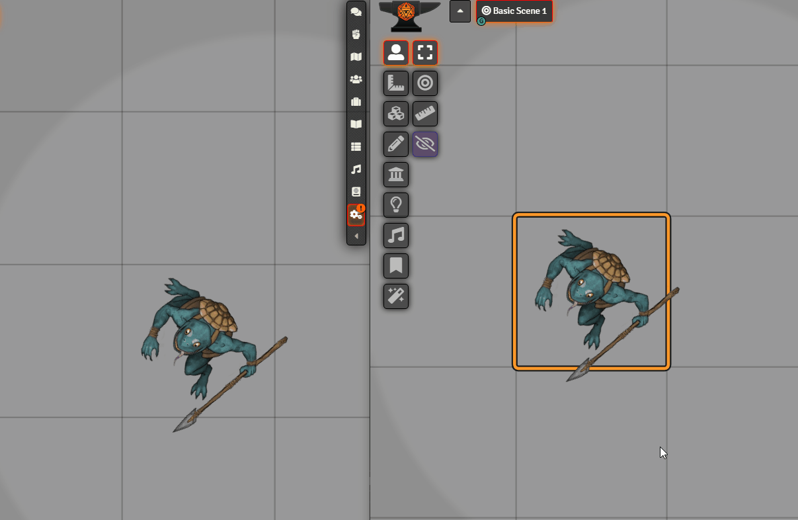
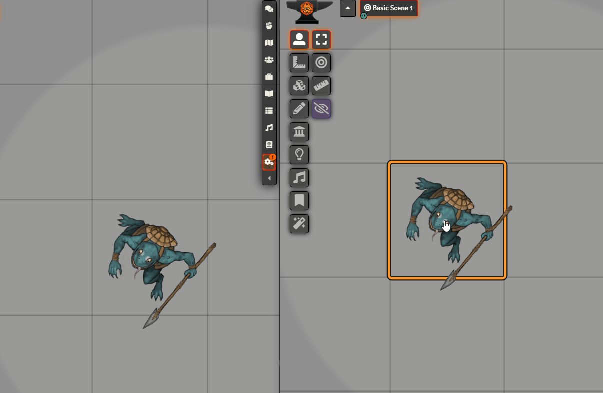

# [Alternative Rotation](https://foundryvtt.com/packages/alternative-rotation/)

 
 
  

Allows rotating tokens and tiles by dragging in a direction and releasing.

To install, browse for it in the module browser, or [directly copy the manifest link for the latest release](https://github.com/itamarcu/AlternativeRotation/releases/latest/download/module.json).

# Gifs

# Features

This module adds a new way of rotating tiles and tokens: holding **R** (configurable) and moving your cursor around.
The token will rotate to face the cursor (with its image "bottom"), settling when you let go of R. This is in 
addition to the default methods of rotation a token in Foundry - shift+scrolling while hovering over it, and shift+arrows
when selecting it. 

You can also hold R while dragging in an empty spot while having multiple tiles/tokens selected; this will make all
selected tiles/tokens turn to face your cursor, until you release the mouse button.  

By **holding Shift** (configurable), rotation will snap to the grid directions (same directions you'd snap to when doing the default 
"fast rotation" in Foundry; 45° or 60°). With R only, rotation will snap to 5 degrees, though you can completely
disable even this snapping in the settings (*"Smooth rotation"*).

Rotation will assume that the bottom of the token image is its "front"; the token looks down when viewing its image.
This is the most common standard for token images.

By default, *"Fast Preview"* is enabled in the settings. It makes your token rotation feel fast and responsive, but it
will not update the token until you let go of the mouse; this means the other players will only see the changes when you
stop rotating the tokens. If you want to show an enemy smoothly rotating to face the players, you should disable this
setting (and tweak the rotation frequency if you find it necessary).

Here's an example of how "Fast Preview" looks like when disabled. The right screen is what you see, and the left screen
is what other players will see.

And when enabled:

